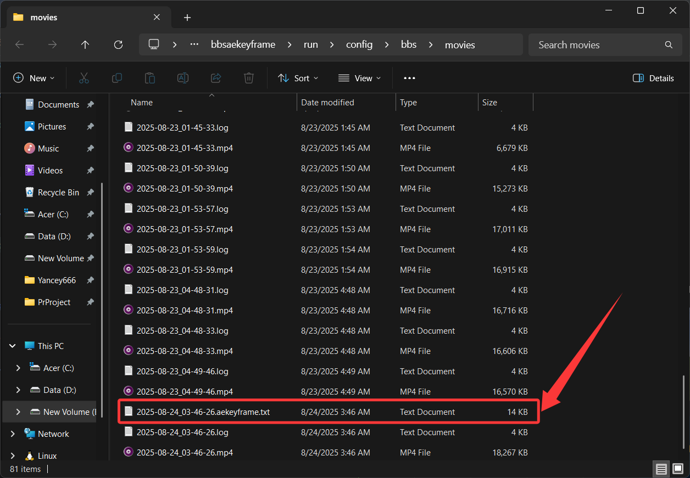
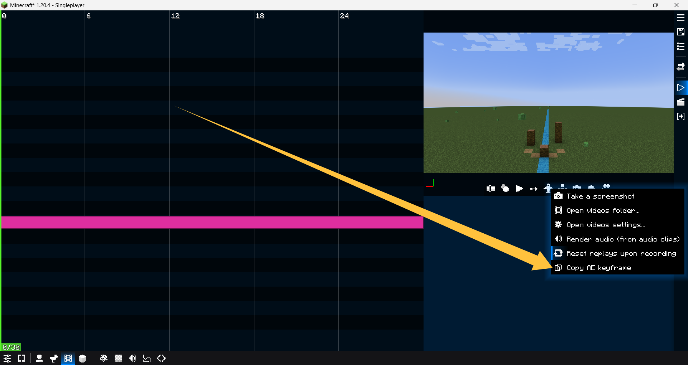

# BBS AE Keyframe Addon

A simple bbs mod addon to get Adobe After Effects keyframe.

> **Note**: This addon is in tested, so it may have some bugs.

## Usage

- **Step1:** export a video, then you can find an AE keyframe txt file in the video folder:

> Note: Don't copy the txt in notepad directly because you can't paste in AE. You can copy them by step2 or other program such as VSCode.

- **Step2:** right-click the record video button, then you can find the copy button:

> Note: The copy button is use for copy the AE keyframe in latest exported video.

# About

Author: [Yancey](https://github.com/Yancey2023)

Email: 1709185482@qq.com

Bilibili: [Minecraft_Yancey](https://space.bilibili.com/470179011)
